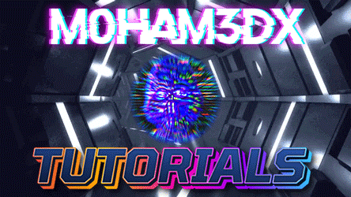

<h1 align="center"> TOC </h1>

1. [Repo Purpose](#repo-purpose)
2. [Tutorials Index](#tutorials-index)

----

# Repo Purpose 

This repository is an `index` for tutorials on my [youtube channel](https://www.youtube.com/channel/UClypqHQkhsNZSD0eRmN3Piw). 

# Tutorials Index 

1. Following are the `urls` to the tutorials 
2. If anyone requires some collateral for sharing it will be mentioned in the table. The collateral will be in a subdirectory in this repository.
3. Not every tutorial has collaterals

> This repository will be updated after it has been posted on my youtube channel

N | Type | Description & Link | Collateral 
|:--:|:--:|:--:|:--:|
1 | ▶️ Youtube | [m0ham3dx - Tenderly 101 Tutorial](https://youtu.be/aGswUJTDQ98)
2 | ▶️ Youtube | [m0ham3dx - Gitpod and Slither Tutorial](https://youtu.be/bgv0rVPgjzY)
3 | ▶️ Youtube | [m0ham3dx - deth.net Ethereum Code Viewer Tutorial](https://youtu.be/d9xE8Cyj7dU)
4 | ▶️ Youtube | [m0ham3dx - Sec3.Dev (Soteria) - Solana Automatic Audit Software Usage & Tutorial](https://youtu.be/jmVBybO6EIo)

